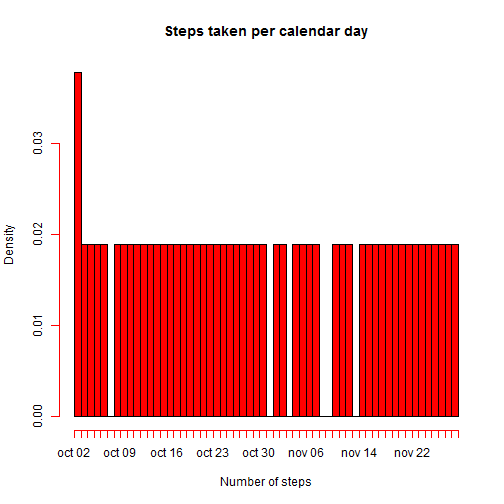
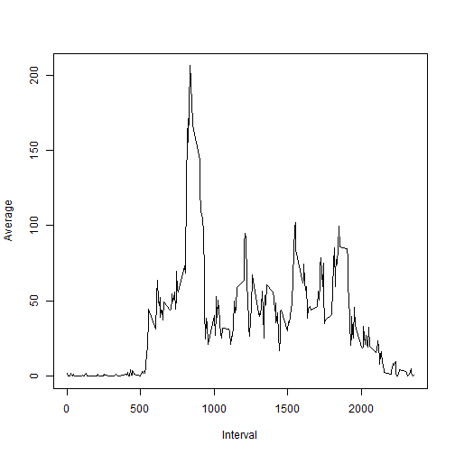
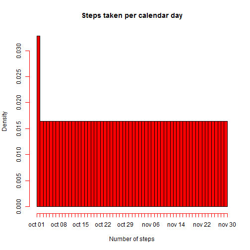
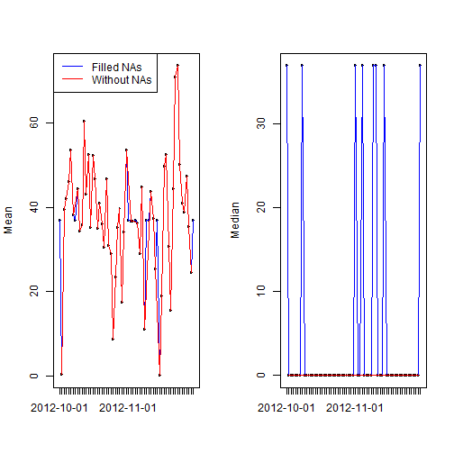
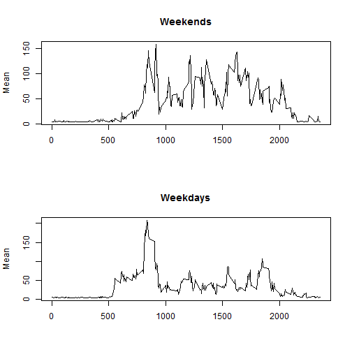

Reproducible Research - Peer Assesment 1
=====================================================================


### 0. Loading and preprocessing the data:

We load the dataset by using the setwd (set working directory) and read.csv commands. Notice you should change the parameter in setwd command to suit your local working directory.


```r
setwd('E:/Data Science Specialization/5_Reproducible_Research/Week_2/Peer_Assesment_1/repdata-data-activity')
activity <- read.csv("activity.csv");
```

To see the dataset loaded the right way, we show first lines of it:


```r
head(activity);
```

```
##   steps       date interval
## 1    NA 2012-10-01        0
## 2    NA 2012-10-01        5
## 3    NA 2012-10-01       10
## 4    NA 2012-10-01       15
## 5    NA 2012-10-01       20
## 6    NA 2012-10-01       25
```

To adress the questions asked in this assesment we need to make two transformations to the loaded dataset:

- Create a dataset that doesn´t have NA values for the column steps of the original "activity" dataset. We will name this dataset as "activity_no_NA".

- Create a dataset that replace NA values for the column steps of the original "activity" dataset. We will use the mean of the column interval for calculating a new value for steps where there are NA values. The name of this dataset is "activity_NEW_NA".


Next, we show how to adress these two transformations:

- Creation of "activity_no_NA" dataset:


```r
NActivity <- is.na(activity$steps);
activity_no_NA <- activity[!NActivity,];
head(activity_no_NA);
```

```
##     steps       date interval
## 289     0 2012-10-02        0
## 290     0 2012-10-02        5
## 291     0 2012-10-02       10
## 292     0 2012-10-02       15
## 293     0 2012-10-02       20
## 294     0 2012-10-02       25
```

- Creation of "activity_NEW_NA" dataset:


```r
activity_NEW_NA <- activity;
MeanInterval <- mean(activity_no_NA$steps);
activity_NEW_NA[NActivity == TRUE,]$steps <- round(MeanInterval);
head(activity_NEW_NA);
```

```
##   steps       date interval
## 1    37 2012-10-01        0
## 2    37 2012-10-01        5
## 3    37 2012-10-01       10
## 4    37 2012-10-01       15
## 5    37 2012-10-01       20
## 6    37 2012-10-01       25
```


### 1. What is mean total number of steps taken per day?

For this part of the assignment, we are going to ignore the missing values in the dataset; it means we are going to work with the "activity_no_NA" dataset to adress this question.

The total number of steps taken per day:


```r
library("sqldf")
sqldf("select date, sum(steps) as StepsPerDay 
      from activity_no_NA group by date")
```

```
##          date StepsPerDay
## 1  2012-10-02         126
## 2  2012-10-03       11352
## 3  2012-10-04       12116
## 4  2012-10-05       13294
## 5  2012-10-06       15420
## 6  2012-10-07       11015
## 7  2012-10-09       12811
## 8  2012-10-10        9900
## 9  2012-10-11       10304
## 10 2012-10-12       17382
## 11 2012-10-13       12426
## 12 2012-10-14       15098
## 13 2012-10-15       10139
## 14 2012-10-16       15084
## 15 2012-10-17       13452
## 16 2012-10-18       10056
## 17 2012-10-19       11829
## 18 2012-10-20       10395
## 19 2012-10-21        8821
## 20 2012-10-22       13460
## 21 2012-10-23        8918
## 22 2012-10-24        8355
## 23 2012-10-25        2492
## 24 2012-10-26        6778
## 25 2012-10-27       10119
## 26 2012-10-28       11458
## 27 2012-10-29        5018
## 28 2012-10-30        9819
## 29 2012-10-31       15414
## 30 2012-11-02       10600
## 31 2012-11-03       10571
## 32 2012-11-05       10439
## 33 2012-11-06        8334
## 34 2012-11-07       12883
## 35 2012-11-08        3219
## 36 2012-11-11       12608
## 37 2012-11-12       10765
## 38 2012-11-13        7336
## 39 2012-11-15          41
## 40 2012-11-16        5441
## 41 2012-11-17       14339
## 42 2012-11-18       15110
## 43 2012-11-19        8841
## 44 2012-11-20        4472
## 45 2012-11-21       12787
## 46 2012-11-22       20427
## 47 2012-11-23       21194
## 48 2012-11-24       14478
## 49 2012-11-25       11834
## 50 2012-11-26       11162
## 51 2012-11-27       13646
## 52 2012-11-28       10183
## 53 2012-11-29        7047
```

We make a histogram of the total number of steps taken each day:


```r
library("sqldf")
StepsPerDay <- sqldf("select date, sum(steps) as StepsPerDay 
      from activity_no_NA group by date")
StepsPerDay$date2 <- as.Date(StepsPerDay$date, "%Y-%m-%d")
hist(as.Date(StepsPerDay$date),53, main = "Steps taken per calendar day", xlab = "Number of steps", col = "red", ffreq = TRUE)
```

 


Calculate and report the mean and median of the total number of steps taken per day:


```r
library("doBy")
summaryBy(steps ~ date, data = activity_no_NA, 
          FUN = list(mean, median));
```

```
##          date steps.mean steps.median
## 1  2012-10-02  0.4375000            0
## 2  2012-10-03 39.4166667            0
## 3  2012-10-04 42.0694444            0
## 4  2012-10-05 46.1597222            0
## 5  2012-10-06 53.5416667            0
## 6  2012-10-07 38.2465278            0
## 7  2012-10-09 44.4826389            0
## 8  2012-10-10 34.3750000            0
## 9  2012-10-11 35.7777778            0
## 10 2012-10-12 60.3541667            0
## 11 2012-10-13 43.1458333            0
## 12 2012-10-14 52.4236111            0
## 13 2012-10-15 35.2048611            0
## 14 2012-10-16 52.3750000            0
## 15 2012-10-17 46.7083333            0
## 16 2012-10-18 34.9166667            0
## 17 2012-10-19 41.0729167            0
## 18 2012-10-20 36.0937500            0
## 19 2012-10-21 30.6284722            0
## 20 2012-10-22 46.7361111            0
## 21 2012-10-23 30.9652778            0
## 22 2012-10-24 29.0104167            0
## 23 2012-10-25  8.6527778            0
## 24 2012-10-26 23.5347222            0
## 25 2012-10-27 35.1354167            0
## 26 2012-10-28 39.7847222            0
## 27 2012-10-29 17.4236111            0
## 28 2012-10-30 34.0937500            0
## 29 2012-10-31 53.5208333            0
## 30 2012-11-02 36.8055556            0
## 31 2012-11-03 36.7048611            0
## 32 2012-11-05 36.2465278            0
## 33 2012-11-06 28.9375000            0
## 34 2012-11-07 44.7326389            0
## 35 2012-11-08 11.1770833            0
## 36 2012-11-11 43.7777778            0
## 37 2012-11-12 37.3784722            0
## 38 2012-11-13 25.4722222            0
## 39 2012-11-15  0.1423611            0
## 40 2012-11-16 18.8923611            0
## 41 2012-11-17 49.7881944            0
## 42 2012-11-18 52.4652778            0
## 43 2012-11-19 30.6979167            0
## 44 2012-11-20 15.5277778            0
## 45 2012-11-21 44.3993056            0
## 46 2012-11-22 70.9270833            0
## 47 2012-11-23 73.5902778            0
## 48 2012-11-24 50.2708333            0
## 49 2012-11-25 41.0902778            0
## 50 2012-11-26 38.7569444            0
## 51 2012-11-27 47.3819444            0
## 52 2012-11-28 35.3576389            0
## 53 2012-11-29 24.4687500            0
```

### 2. What is the average daily activity pattern?

Make a time series plot (i.e. type = "l") of the 5-minute interval (x-axis) and the average number of steps taken, averaged across all days (y-axis)


```r
library("doBy")
AvgInterval <- summaryBy(steps ~ interval, data = activity_no_NA, 
          FUN = list(mean))
plot(AvgInterval$interval, AvgInterval$steps.mean, type = "l", xlab = "Interval", ylab = "Average");
```

 

Which 5-minute interval, on average across all the days in the dataset, contains the maximum number of steps?

We adress this question using the next R code:


```r
AvgMax <- max(AvgInterval$steps.mean);
AvgInterval[AvgInterval$steps.mean == AvgMax,];
```

```
##     interval steps.mean
## 104      835   206.1698
```

The above result shows that 8:35 is the 5 minute time interval that has more steps in average.

### 3. Imputing missing values

Note that there are a number of days/intervals where there are missing values (coded as NA). The presence of missing days may introduce bias into some calculations or summaries of the data. We went in advance of this issue by creating the dataset "activity_NEW_NA" in pre-processing of original dataset activity.

Therefore, the total number of missing values in the dataset is calculated with the length of the logical vector:


```r
length(NActivity[NActivity==TRUE]);
```

```
## [1] 2304
```

As said above, we have created the "activity_NEW_NA" dataset replacing NA values for steps with an average value (see item 0 of this document).


We make a histogram of the total number of steps taken each day and Calculate and report the mean and median total number of steps taken per day.


We make a histogram of the total number of steps taken each day:


```r
library("sqldf")
StepsPerDay <- sqldf("select date, sum(steps) as StepsPerDay 
      from activity_NEW_NA group by date")
StepsPerDay$date2 <- as.Date(StepsPerDay$date, "%Y-%m-%d")
hist(as.Date(StepsPerDay$date),53, main = "Steps taken per calendar day", xlab = "Number of steps", col = "red", ffreq = TRUE)
```

 


Calculate and report the mean and median of the total number of steps taken per day:


```r
library("doBy")
summaryBy(steps ~ date, data = activity_NEW_NA, 
          FUN = list(mean, median));
```

```
##          date steps.mean steps.median
## 1  2012-10-01 37.0000000           37
## 2  2012-10-02  0.4375000            0
## 3  2012-10-03 39.4166667            0
## 4  2012-10-04 42.0694444            0
## 5  2012-10-05 46.1597222            0
## 6  2012-10-06 53.5416667            0
## 7  2012-10-07 38.2465278            0
## 8  2012-10-08 37.0000000           37
## 9  2012-10-09 44.4826389            0
## 10 2012-10-10 34.3750000            0
## 11 2012-10-11 35.7777778            0
## 12 2012-10-12 60.3541667            0
## 13 2012-10-13 43.1458333            0
## 14 2012-10-14 52.4236111            0
## 15 2012-10-15 35.2048611            0
## 16 2012-10-16 52.3750000            0
## 17 2012-10-17 46.7083333            0
## 18 2012-10-18 34.9166667            0
## 19 2012-10-19 41.0729167            0
## 20 2012-10-20 36.0937500            0
## 21 2012-10-21 30.6284722            0
## 22 2012-10-22 46.7361111            0
## 23 2012-10-23 30.9652778            0
## 24 2012-10-24 29.0104167            0
## 25 2012-10-25  8.6527778            0
## 26 2012-10-26 23.5347222            0
## 27 2012-10-27 35.1354167            0
## 28 2012-10-28 39.7847222            0
## 29 2012-10-29 17.4236111            0
## 30 2012-10-30 34.0937500            0
## 31 2012-10-31 53.5208333            0
## 32 2012-11-01 37.0000000           37
## 33 2012-11-02 36.8055556            0
## 34 2012-11-03 36.7048611            0
## 35 2012-11-04 37.0000000           37
## 36 2012-11-05 36.2465278            0
## 37 2012-11-06 28.9375000            0
## 38 2012-11-07 44.7326389            0
## 39 2012-11-08 11.1770833            0
## 40 2012-11-09 37.0000000           37
## 41 2012-11-10 37.0000000           37
## 42 2012-11-11 43.7777778            0
## 43 2012-11-12 37.3784722            0
## 44 2012-11-13 25.4722222            0
## 45 2012-11-14 37.0000000           37
## 46 2012-11-15  0.1423611            0
## 47 2012-11-16 18.8923611            0
## 48 2012-11-17 49.7881944            0
## 49 2012-11-18 52.4652778            0
## 50 2012-11-19 30.6979167            0
## 51 2012-11-20 15.5277778            0
## 52 2012-11-21 44.3993056            0
## 53 2012-11-22 70.9270833            0
## 54 2012-11-23 73.5902778            0
## 55 2012-11-24 50.2708333            0
## 56 2012-11-25 41.0902778            0
## 57 2012-11-26 38.7569444            0
## 58 2012-11-27 47.3819444            0
## 59 2012-11-28 35.3576389            0
## 60 2012-11-29 24.4687500            0
## 61 2012-11-30 37.0000000           37
```

Do these values differ from the estimates from the first part of the assignment? What is the impact of imputing missing data on the estimates of the total daily number of steps?

The real impact of filling NA values from the histogram point of view isn't really big; all we see that might be relevant is that now we have values in some days that didn't have values when we had NA steps.

To adress the differences on mean and median, we show the next plot:


```r
library("doBy")
TempnewNA <- summaryBy(steps ~ date, data = activity_NEW_NA, 
          FUN = list(mean, median));
TempnewNA$Class <- "FilledNA";
TempnoNA <- summaryBy(steps ~ date, data = activity_no_NA, 
                       FUN = list(mean, median));
TempnoNA$Class <- "WithOutNA";
activityclass <- rbind(TempnewNA, TempnoNA);

par(mfcol = c(1,2))
plot(TempnewNA$date, TempnewNA$steps.mean, type = "l", ylab = "Mean", xlab = "")
lines(TempnewNA$date, TempnewNA$steps.mean, type = "l", col = "blue")
lines(TempnoNA$date, TempnoNA$steps.mean, type = "l", col = "red")
legend("topleft", legend = c("Filled NAs", "Without NAs"), lty = c(1,1), col = c("blue", "red"))

plot(TempnewNA$date, TempnewNA$steps.median, type = "l", ylab = "Median", xlab = "")
lines(TempnewNA$date, TempnewNA$steps.median, type = "l", col = "blue")
lines(TempnoNA$date, TempnoNA$steps.median, type = "l", col = "red")
```

 


### 4. Are there differences in activity patterns between weekdays and weekends?

For this part the weekdays() function may be of some help here. Use the dataset with the filled-in missing values for this part.

Create a new factor variable in the dataset with two levels - "weekday" and "weekend" indicating whether a given date is a weekday or weekend day:


```r
activity_NEW_NA$WeekDay <- weekdays(as.Date(activity_NEW_NA$date, , "%Y-%m-%d"));
activity_NEW_NA$Weekend[activity_NEW_NA$WeekDay == "sábado"] <- "Weekend";
activity_NEW_NA$Weekend[activity_NEW_NA$WeekDay == "domingo"] <- "Weekend";
activity_NEW_NA$Weekend[is.na(activity_NEW_NA$Weekend)] <- "WeekDay";
Weekday <- activity_NEW_NA[activity_NEW_NA$Weekend == "WeekDay",];
Weekend <- activity_NEW_NA[activity_NEW_NA$Weekend == "Weekend",];
```

Make a panel plot containing a time series plot (i.e. type = "l") of the 5-minute interval (x-axis) and the average number of steps taken, averaged across all weekday days or weekend days (y-axis). See the README file in the GitHub repository to see an example of what this plot should look like using simulated data.


```r
library("doBy")
PlotPanelEnd <- summaryBy(steps ~ interval, data = Weekend, 
          FUN = list(mean));
par(mfcol = c(2,1))
plot(PlotPanelEnd$interval, PlotPanelEnd$steps.mean, type = "l", ylab = "Mean", xlab = "", main = "Weekends")

PlotPanelDay <- summaryBy(steps ~ interval, data = Weekday, 
          FUN = list(mean));
plot(PlotPanelDay$interval, PlotPanelDay$steps.mean, type = "l", ylab = "Mean", xlab = "", main = "Weekdays")
```

 

